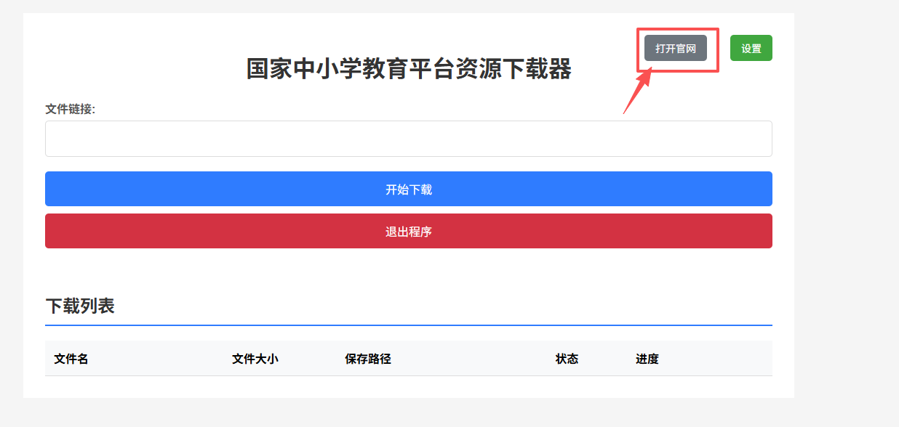
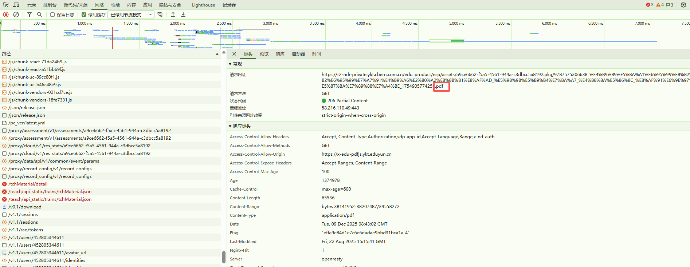
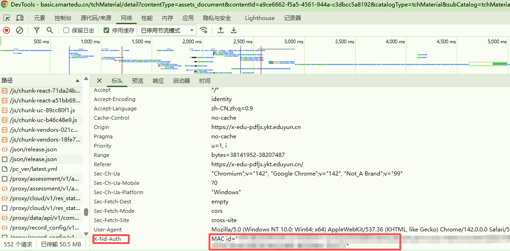
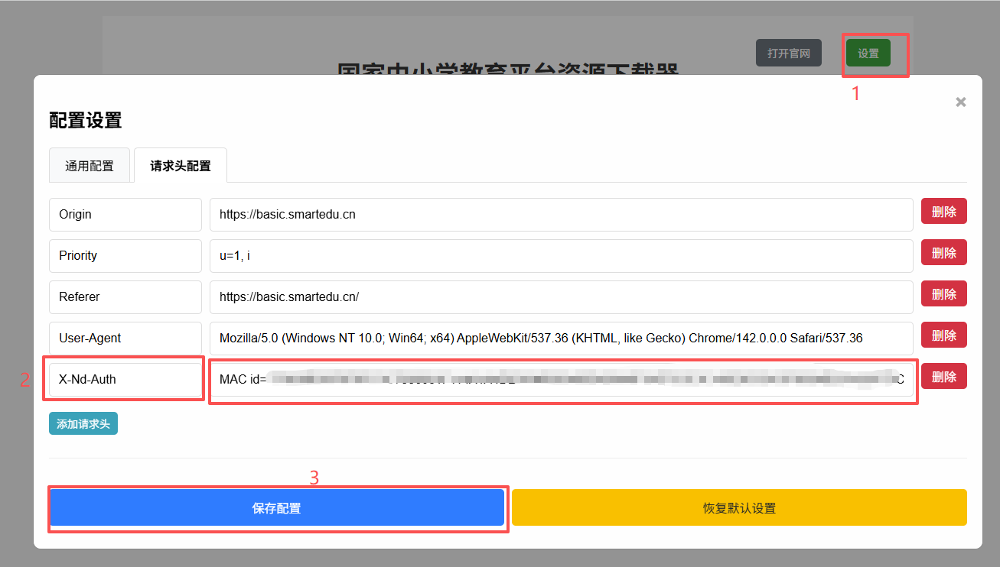
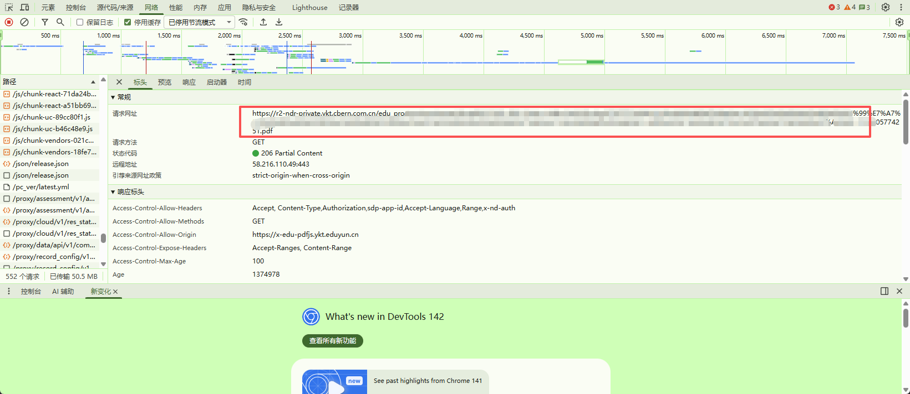

# 教材下载器 (chinaTextBookDownloader)

这是一个用于从国家中小学教育资源平台下载PDF教材的工具，支持命令行模式和Web界面模式。

## 功能特性

- 支持命令行模式和Web界面模式
- 断点续传功能
- 进度显示
- 多平台支持（Windows、Linux、macOS）
- 自动配置管理

## 安装

### 方法1：下载预编译版本
从[Releases](https://github.com/dorlolo/chinaTextBookDownloader/releases)页面下载适合您系统的预编译版本。

### 方法2：源码编译
```bash
go build -o downloader.exe .
```

## 使用方法

### 命令行模式

```bash
# 基本用法
./downloader -url="https://example.com/file.pdf"

# 指定输出文件
./downloader -url="https://example.com/file.pdf" -out="/path/to/output.pdf"

# 设置超时时间
./downloader -url="https://example.com/file.pdf" -timeout="60s"

# 添加自定义请求头
./downloader -url="https://example.com/file.pdf" -H "X-Nd-Auth: xxxx" -H "Custom-Header: xxxx"
```

### Web界面模式

```bash
# 启动Web界面（默认端口8080）
./downloader -mode=web

# 指定端口
./downloader -mode=web -port=9090
```

访问 `http://localhost:8080` 使用Web界面。

## Web界面操作说明

1. 启动工具Web界面
```cmd
downloader.exe -mode web
```

2. 准备工作 
- 2.1 点击【打开官网】

- 2.2 注册登录
- 2.3 打开所需下载的资源 -- 然后按F12打开控制台 -- 刷新页面 -- 找到.pdf结尾的请求

- 2.4 复制请求头中的`X-Nd-Auth`后面跟随的值

打开工具设置页面，将`X-Nd-Auth`后面的值粘贴到`请求头`中,并点击`保存配置`。这一步不需要反复操作，后面如果遇到无法下载资源的情况再修改。


3. 复制网址粘贴到工具中下载即可


## 命令行参数

| 参数 | 说明 | 默认值 |
|------|------|--------|
| `-mode` | 运行模式 (cli 或 web) | cli |
| `-url` | PDF文件的HTTP/HTTPS URL | 无 |
| `-out` | 输出文件路径 | 当前目录下的原文件名 |
| `-timeout` | 下载超时时间 | 30s |
| `-chunk` | 分块下载大小 | 4MB |
| `-port` | Web服务端口 | 8080 |
| `-config` | 配置文件路径 | config.json |
| `-H` | HTTP请求头 (可多次使用) | 无 |

## 配置文件

工具会自动生成 `config.json` 配置文件，包含常用的请求头和其他设置。

## 构建

使用以下命令构建项目：

```bash
go build -o downloader .
```

## 贡献

欢迎提交Issue和Pull Request。

## 许可证

MIT License